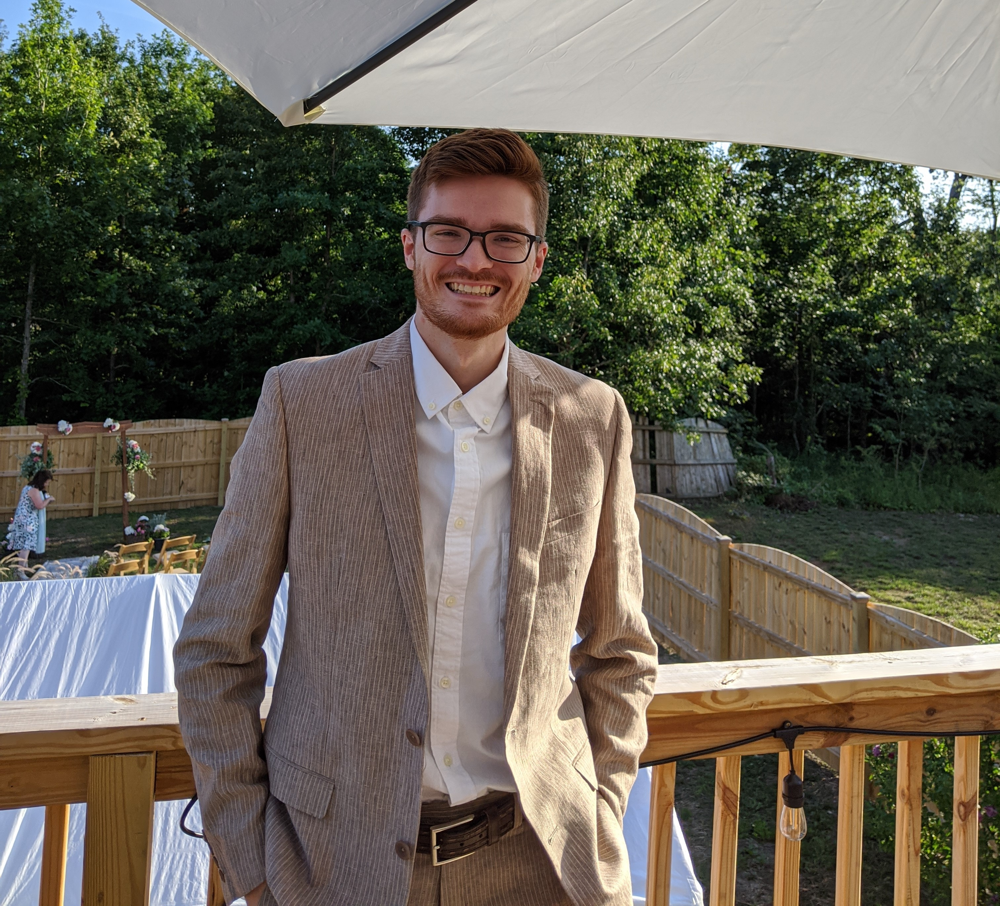

# CIS641-HW2-Ebeling

## Author: George Ebeling

## Interests

* **Rock Climbing**: I have been an avid climber for the last couple years. My brother and I do a fair amount of bouldering together at the GVSU gym and TerraFirma. Recently, I became interestsed in sport climbing and did a trip to Red River Gorge in Kentucky to do some outdoor climbing.
* **Rocket League**: For the last 3 years I have been playing Rocket League with the GVSU esports club. Rocket League is a physicals based game of car soccer (or 'soccar') with the additional mechanic of acrobatic functions of the cars. I occassionally play with different online communities outside of the university.
* **Cyber Security**: While I do not have interest in purusing cyber security as a profession, I do find it interesting and enjoy following news and learning more about its history. I am an avid listener of Darknet Diaries, a podcast that tells indepth and sometimes unkown stories of the information security field.

## Technical Background

* **Schooling**: In my courses for computer engineering, I did a lot of work with embedded C programming. I took various courses where I used C++, MATLAB, Java, and Python3. 
* **Work Experience**: I gained work experience with C#, C++, and SQL while working at my co-op. I wrote software for x86 Windows 10 and Linux, and ARM Linux. I also worked with batch, bash, and powershell scripts for automating database scripts.
* **Miscellanious**: I have helped with science olympiad and FIRST robitics teams where I helped the students learn Python3 and Java programming.
* **Home**: I try to diversify the languages and platforms that I use when doing personal projects. Using Texas Instruments launchpads or Raspberry Pis, I try to have some level of embedded computing that either communicates sensor readings or controls servos and motors. For the desktop side of the projects I have used C#, C++, and Python to perform more advanced computing tasks.

## CIS 641 Project: <a href="https://computergeek1507.github.io/GVSU-CIS641-Jolly-Snowman/">Jolly Snowman</a>

### Status: on going

The goal of this project was to create an application that would create models of addressable LED Christmas light props. These models contain information about where the LEDs exist in 2D space and are in a format suitable to be used in the X-Light program.

Analysis of the video was done using EmguCV. The C# libraries of OpenCV. This library contains tools that were useful for performing the actual analysis.
